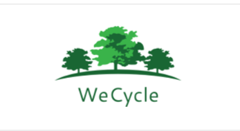

# IIP-Project
### In this Project, I did app development under NATIVE SCRIPT environment using ANGULAR framework.

Platforms
-Visual Studio Code
-Native Script Playground

There are 5 pages in the App
1. Login - Customers, Businesses and Workers will login here
2. Home - They will select out of the 3 options to go in as a customer, a business or a worker.
3. Customer - Here there will be 2 options, 
                    -Either to schedule a garbage pickup.
                    -Enter shoop to buy products of businesses we have tie up with.
4. Business - Here Businesses can register on our platform.
5. Worker - Here workers can see their next pickups.

